## Introduction


<p class="centered"> 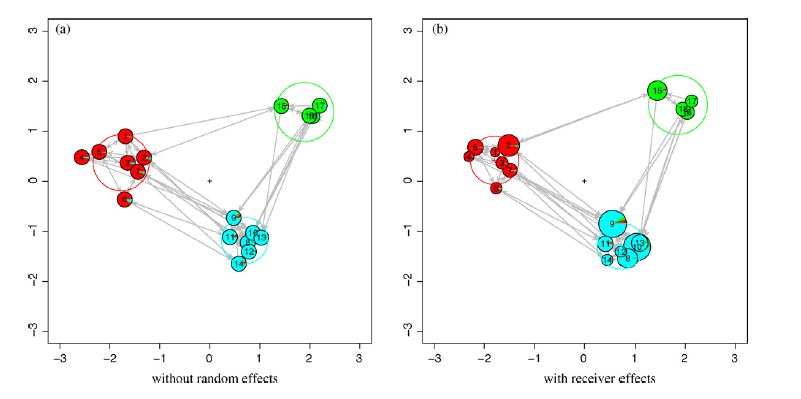 </p>

- With no node-level covariates, the latent space portion of an LSM is just a low-dimensional representation of the network
  - appropriate as a layout algorithm or for uncovering "clusters" (<a href="http://dx.doi.org/10.1016/j.socnet.2009.04.001">Krivitsky et al. 2009</a>).

---

## LSM with node covariates

- When node-covariates are of interest, latent space is a "random effect"
  - influence of node covariates on the network are interpreted as an effect on dyadic formation
- The latent space represents both unobserved node-level covariates and unexplained network effects.
- Statistically, LSM are appealing- push out increasingly unexplainable effects to the latent social space
- But what is the qualitative meaning of the latent space in this case?
  - Particularly important as LSMs are sold as a way to visualize data

---

## Research questions

- how does the latent space inform us of latent dyadic and network-level effects that drove the formation of the network?

- when no effects exist outside observed node-level covariates, what does the latent space look like?
  
- how do these two things change with different parameterizations of the model?
  
---

## Overview of approach

- Generate some networks 

- Run LSM on them with different parameterizations

- Visualize the latent space, try and grasp qualitative meaning

- Check the latent space for (non) uniformity where we expect it (semi-qualitatively)

---

## LSM formulation in latentnet
$$\begin{align*}
\text{logit}\, P[Y_{ij} = 1 ] &= \beta_k^TX_{ijk} - |Z_i-Z_j|, k = 1...\color{red}K  \\
\beta_k     &\overset{\text{iid}}{\sim} \text{N}(\xi_k,\psi^2_k)  \\
Z_i        &\overset{\text{iid}}{\sim} \sum_{g=1}^{\color{red}G} \lambda_g\text{MVN}_d(\mu_g,\sigma_g^2I_d) \\
\mu_g      &\overset{\text{iid}}{\sim} \text{MVN}_d(0,\omega^2I_d) \\
\sigma_g^2 &\overset{\text{iid}}{\sim} \sigma_0^2\text{Inv}\chi_\alpha^2 \\
(\lambda_1,...,\lambda_g) &\overset{\text{iid}}{\sim} \text{Dirichlet}(\nu_1,...,\nu_g)\end{align*}$$

---

## Generating the simulated networks

- Overview
  - Calculate a similarity matrix w/ a baseline tie probability
  - Augment these probabilities with shared group information
  - Draw a random network from the similarity matrix
  
- Some default parameters:


```r
N_ACTORS <- 8
OUTGROUP_TIE <- 0.01
INGROUP_TIE <- 1
N_COVARIATES <- 1
N_GROUPS <- 2
```


---

## Start with a similarity matrix

```r
similarity_matrix <- matrix(0, nrow = N_ACTORS, ncol = N_ACTORS)
similarity_matrix[upper.tri(similarity_matrix)] <- runif(N_ACTORS * (N_ACTORS - 
    1)/2, 0, OUTGROUP_TIE * 2)
pandoc.table(similarity_matrix, style = "rmarkdown", digits = 2)
```


|   |         |        |        |        |         |       |        |
|:-:|:-------:|:------:|:------:|:------:|:-------:|:-----:|:------:|
| 0 | 0.00096 | 0.0058 | 0.0099 | 0.018  | 0.0097  | 0.002 | 0.018  |
| 0 |    0    | 0.0091 | 0.016  | 0.016  |  0.019  | 0.011 | 0.0098 |
| 0 |    0    |   0    | 0.011  | 0.015  | 0.0054  | 0.019 | 0.018  |
| 0 |    0    |   0    |   0    | 0.0069 |  0.014  | 0.011 | 0.0049 |
| 0 |    0    |   0    |   0    |   0    | 0.00052 | 0.017 | 0.008  |
| 0 |    0    |   0    |   0    |   0    |    0    | 0.018 | 0.018  |
| 0 |    0    |   0    |   0    |   0    |    0    |   0   | 0.013  |
| 0 |    0    |   0    |   0    |   0    |    0    |   0   |   0    |


---

## Generate (random) groupings

```r
## Get 'random'' groupings
groupings <- data.frame(id = 1:N_ACTORS, Group1 = c(rep(1, N_ACTORS/2), rep(2, 
    N_ACTORS/2)))
pandoc.table(groupings, style = "rmarkdown", digits = 2)
```


|  id  |  Group1  |
|:----:|:--------:|
|  1   |    1     |
|  2   |    1     |
|  3   |    1     |
|  4   |    1     |
|  5   |    2     |
|  6   |    2     |
|  7   |    2     |
|  8   |    2     |


---
## Calculate percentage of group memberships shared


```r
## Determine matrix of co-memberships in groups, normalized by number of
## groups
percent_shared_memberships <- ifelse(outer(groupings[, 2], groupings[, 2], FUN = "-") == 
    0, 1, 0)
pandoc.table(percent_shared_memberships, style = "rmarkdown", digits = 2)
```


|   |   |   |   |   |   |   |   |
|:-:|:-:|:-:|:-:|:-:|:-:|:-:|:-:|
| 1 | 1 | 1 | 1 | 0 | 0 | 0 | 0 |
| 1 | 1 | 1 | 1 | 0 | 0 | 0 | 0 |
| 1 | 1 | 1 | 1 | 0 | 0 | 0 | 0 |
| 1 | 1 | 1 | 1 | 0 | 0 | 0 | 0 |
| 0 | 0 | 0 | 0 | 1 | 1 | 1 | 1 |
| 0 | 0 | 0 | 0 | 1 | 1 | 1 | 1 |
| 0 | 0 | 0 | 0 | 1 | 1 | 1 | 1 |
| 0 | 0 | 0 | 0 | 1 | 1 | 1 | 1 |


---

## Reconfigure similarity matrix w/ group info

```r
## Add to si
similarity_matrix <- similarity_matrix + INGROUP_TIE * percent_shared_memberships
diag(similarity_matrix) <- 0
similarity_matrix[lower.tri(similarity_matrix)] <- 0
similarity_matrix <- ifelse(similarity_matrix > 1, 1, similarity_matrix)
pandoc.table(similarity_matrix, style = "rmarkdown", digits = 2)
```


|   |   |   |   |        |        |       |        |
|:-:|:-:|:-:|:-:|:------:|:------:|:-----:|:------:|
| 0 | 1 | 1 | 1 | 0.018  | 0.0097 | 0.002 | 0.018  |
| 0 | 0 | 1 | 1 | 0.016  | 0.019  | 0.011 | 0.0098 |
| 0 | 0 | 0 | 1 | 0.015  | 0.0054 | 0.019 | 0.018  |
| 0 | 0 | 0 | 0 | 0.0069 | 0.014  | 0.011 | 0.0049 |
| 0 | 0 | 0 | 0 |   0    |   1    |   1   |   1    |
| 0 | 0 | 0 | 0 |   0    |   0    |   1   |   1    |
| 0 | 0 | 0 | 0 |   0    |   0    |   0   |   1    |
| 0 | 0 | 0 | 0 |   0    |   0    |   0   |   0    |


---

## Draw a random network from similarity matrix

```r
random_draw <- matrix(0, nrow = N_ACTORS, ncol = N_ACTORS)
random_draw[upper.tri(random_draw)] <- rbinom(rep(1, N_ACTORS * (N_ACTORS - 
    1)/2), 1, as.vector(similarity_matrix[upper.tri(similarity_matrix)]))
lower_indices <- lower.tri(random_draw)
random_draw[lower_indices] <- t(random_draw)[lower_indices]
pandoc.table(random_draw, style = "rmarkdown", digits = 2)
```


|   |   |   |   |   |   |   |   |
|:-:|:-:|:-:|:-:|:-:|:-:|:-:|:-:|
| 0 | 1 | 1 | 1 | 0 | 0 | 0 | 0 |
| 1 | 0 | 1 | 1 | 0 | 0 | 0 | 0 |
| 1 | 1 | 0 | 1 | 0 | 0 | 0 | 0 |
| 1 | 1 | 1 | 0 | 0 | 0 | 0 | 0 |
| 0 | 0 | 0 | 0 | 0 | 1 | 1 | 1 |
| 0 | 0 | 0 | 0 | 1 | 0 | 1 | 1 |
| 0 | 0 | 0 | 0 | 1 | 1 | 0 | 1 |
| 0 | 0 | 0 | 0 | 1 | 1 | 1 | 0 |


---

## Finally, get the network


---

## Results

- CIDnetworks vs latentnet packages
- Visual comparison of latent spaces
- Check Ripley's L, a common spatial statistic, for uniformity in the latent space where we (don't) expect it
$$\begin{align*} 
\hat{K}(t) &= \lambda^{-1}\sum_{i \neq j}\frac{I(d_{ij} \, <  \, t )}{n} \\
\hat{L}(t) &= (\frac{\hat{K}}{\pi}) \end{align*}$$
  - Do these latter two for different $NG$, $K$ and $G$

---

## Initial Network Settings


```r
N_ACTORS <- 50
OUTGROUP_TIE <- 0.03
N_COVARIATES <- 1
N_GROUPS <- 2
INGROUP_TIE <- 0.9
N_GAUSSIANS <- 1
```


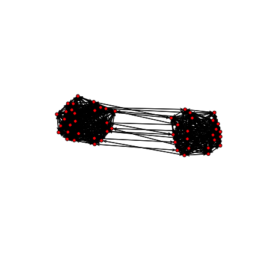

  
---

## CIDnetworks vs ERGMM


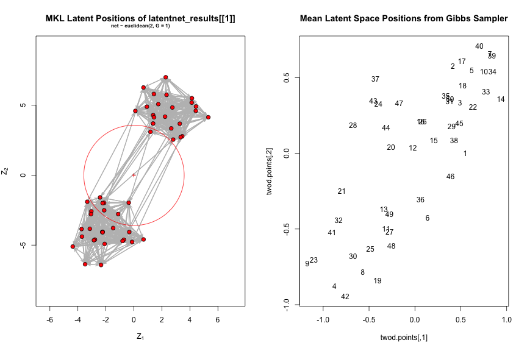


---

## Partialling out node covariates 


```r
N_COVARIATES <- 3
```


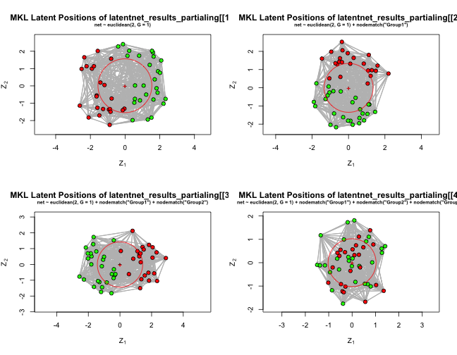


---
  
  
## Modifying the Number of Gaussians


```r
N_GAUSSIANS <- 3
```


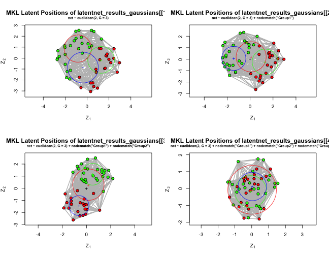


---

## With more groups


```r
N_COVARIATES <- 2
N_GROUPS <- 4
N_GAUSSIANS <- 1
```


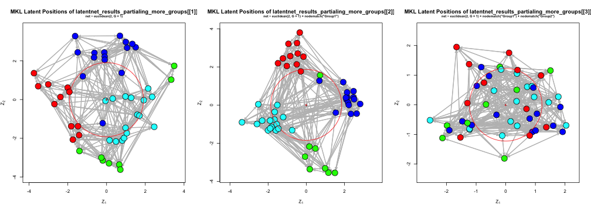


---
   
## Modifying the Number of Gaussians (again)


```r
N_GAUSSIANS <- 2
```


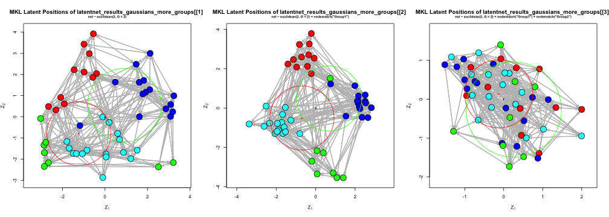


---

## Ripley's L - Uniform data, 2D-Gaussian data


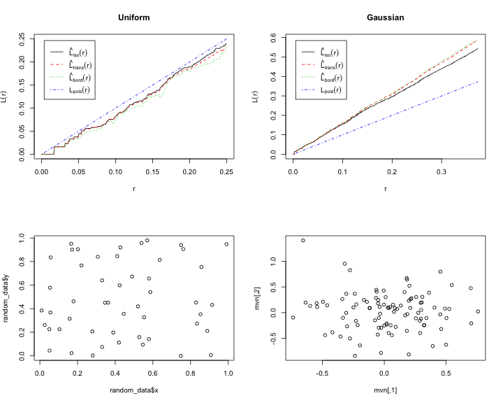


---


## Ripley's L - Partialling data


```
##      lty col  key          label                              meaning
## iso    1   1  iso hat(L)[iso](r) isotropic-corrected estimate of L(r)
## theo   2   2 theo     L[pois](r)             theoretical Poisson L(r)
```

```
##      lty col  key          label                              meaning
## iso    1   1  iso hat(L)[iso](r) isotropic-corrected estimate of L(r)
## theo   2   2 theo     L[pois](r)             theoretical Poisson L(r)
```

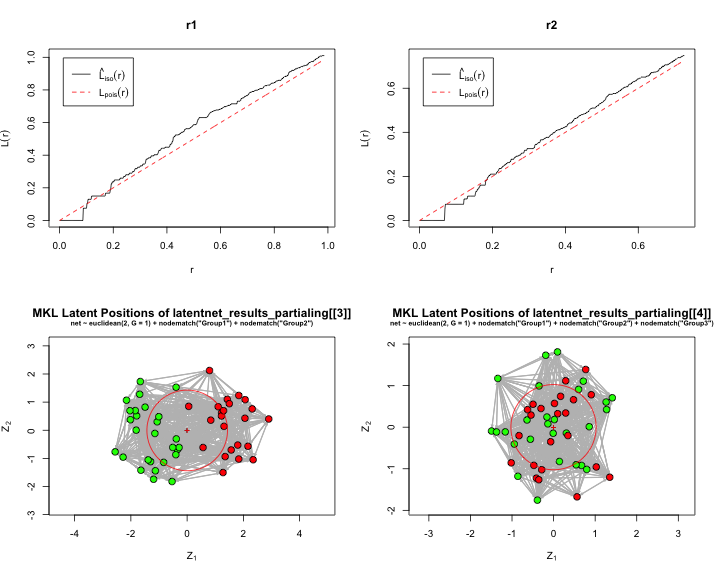


---

## Ripley's L - W/ ++ Gaussians


```
##      lty col  key          label                              meaning
## iso    1   1  iso hat(L)[iso](r) isotropic-corrected estimate of L(r)
## theo   2   2 theo     L[pois](r)             theoretical Poisson L(r)
```

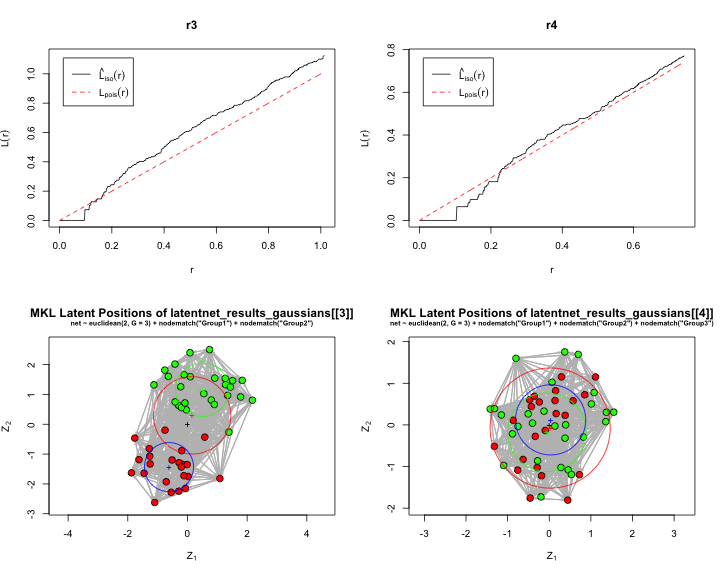


---

## Ripley's L - More Groups


```
##      lty col  key          label                              meaning
## iso    1   1  iso hat(L)[iso](r) isotropic-corrected estimate of L(r)
## theo   2   2 theo     L[pois](r)             theoretical Poisson L(r)
```

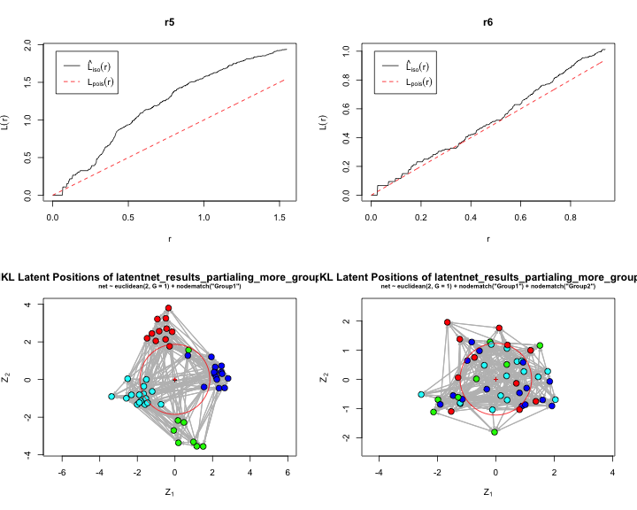


---

## Ripley's L - More Groups, ++ Gaussians


```
##      lty col  key          label                              meaning
## iso    1   1  iso hat(L)[iso](r) isotropic-corrected estimate of L(r)
## theo   2   2 theo     L[pois](r)             theoretical Poisson L(r)
```

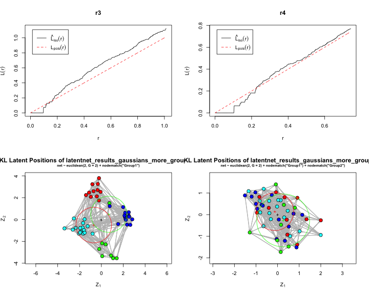


---


## Next Steps - Experimental Design

|         Parameter Name | Description   |      Conditions                |
|:---------------------:| :---: | :-----------------------------------------------:|
|      $N$ |  Number of actors        |     50             |
|     $d_{out}$ |  Baseline tie density       |   .01, .1    |
|   $d_{in}$ |  Within group tie probability   | .3, .6 |
|     $K$    | Number of covariates in model |    0, 1, 3 |
| $NG$  |  Number of groups per covariate |      2, 4            |
|   $G$  | Number of Gaussians  |            1, 2, 3         |
| $\sigma_0$ | Covariance of Gaussians | .125, ? | 
| ... | Graph structure | Core-periphary | 

- Run an LSM on each combination of these parameters
- Get some kind of point estimate of $\hat{L}(t)$

---  

## Conclusion
- "Findings"
  - The latent space does give some inclination as to dyadic covariates missing from the model
  - When the latent space is representing only noise, it appears close to a random process along Ripley's L
  - Neither of these things appear to change much with a "mis-parameterized" LSM
- None of this is particularly surprising. But...
  - In playing around, I noticed that as OUTGROUP_TIE decreased, these results deteriorate
  - Thus, it would be interesting to work with more realistic networks and see if these results hold

---
  
## Bibliography


- Pavel Krivitsky, Mark Handcock, Adrian Raftery, Peter Hoff,   (2009) Representing degree distributions, clustering, and homophily in social networks with latent cluster random effects models.  *Social Networks*  **31**  (3)   204-213  [10.1016/j.socnet.2009.04.001](http://dx.doi.org/10.1016/j.socnet.2009.04.001)


